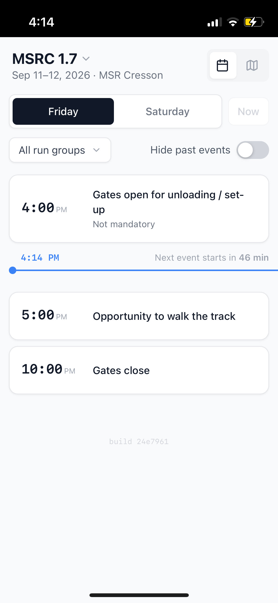
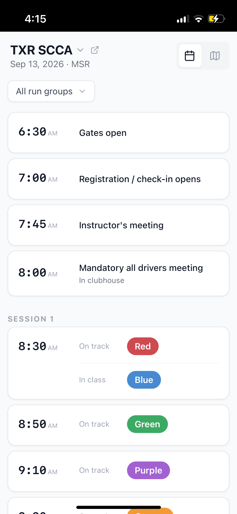
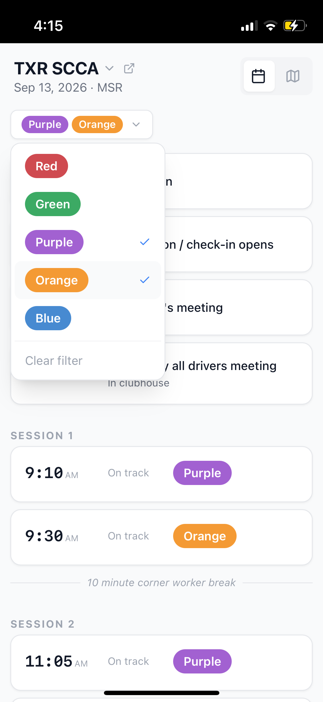

# HPDE Schedule

See the day's HPDE track schedule at a glance — what's happening now, what's
next, and which sessions are yours. Built for checking on your phone between
runs.

**Live site:** https://inko9nito.github.io/hpde/

## Features

- **Live "now" line** shows what's happening at this moment and counts down
  to what's next
- **Run group filter** — pick your color(s) and the schedule highlights just
  your sessions
- **On track / in class** badges make it obvious who's driving and who's in
  the classroom for each session
- **iPhone Home Screen widget** — see the schedule without opening the app
  (see below)

  

---

## iPhone Home Screen widget

Add a widget to your Home Screen and see today's schedule without opening
the app — see [`scripts/`](./scripts/README.md) for setup instructions.

**Latest script:** https://raw.githubusercontent.com/inko9nito/hpde/main/scripts/hpde-widget.js
— always the current version, the one to share.

> **Known issue:** the widget doesn't update instantly — iOS controls when
> widgets actually refresh, so there can be a short delay before it catches
> up to what's happening on track.
