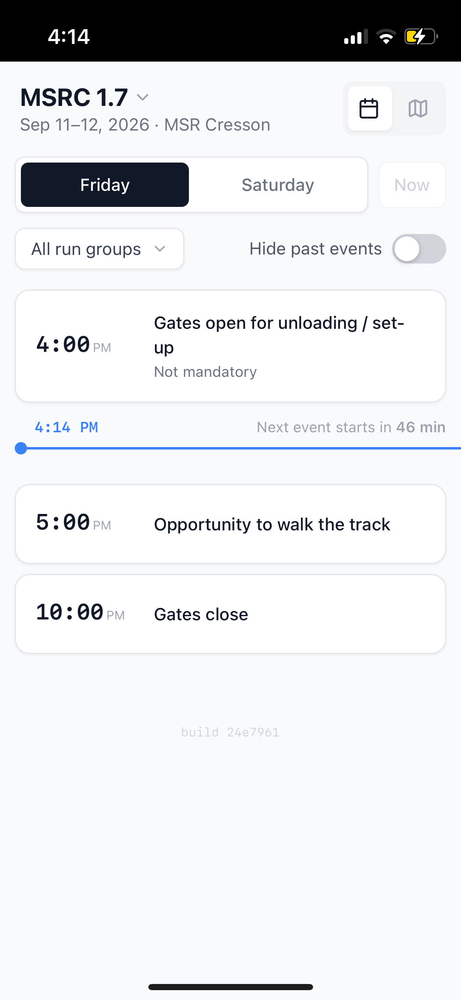
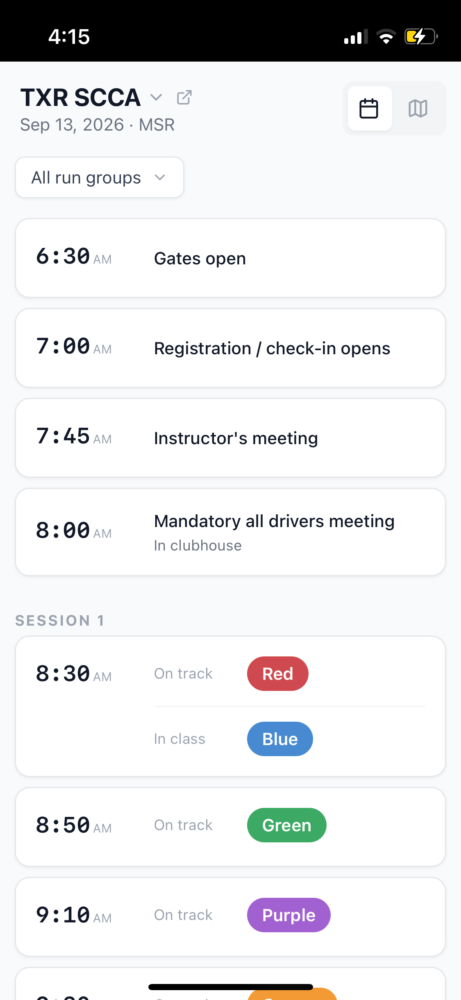
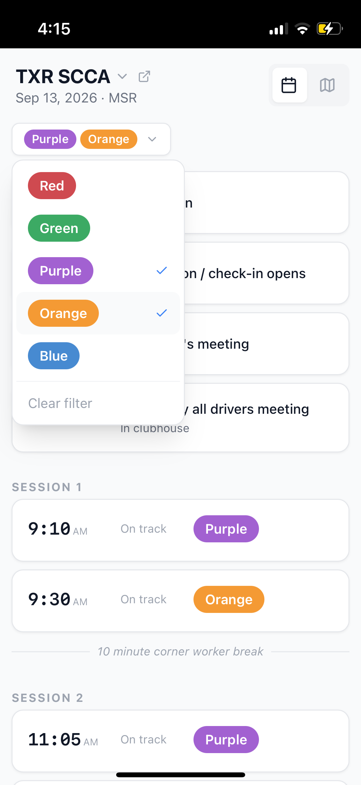
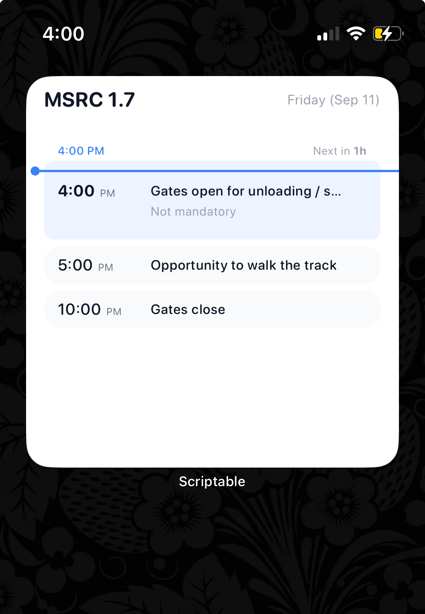

# HPDE Schedule

See the day's HPDE track schedule at a glance — what's happening now, what's
next, and which sessions are yours. Built for checking on your phone between
runs.

**Live site:** https://myhpde.netlify.app/

## Features

- **Three tabs** along the bottom (#274): **Events** (the list and
  calendar of events), **Tracks** (your lap times by track layout) and
  **More** (#345), a list of the rest: **Instructor evaluations** and the
  **Garage** (your cars, a dated log of their tires, brakes and fluids,
  and each session's tire pressures), each sliding in over it
- **Live "now" line** shows what's happening at this moment and counts down
  to what's next
- **Run group filter** — pick your color(s) and the schedule highlights just
  your sessions
- **On track / in class** badges make it obvious who's driving and who's in
  the classroom for each session
- **iPhone Home Screen widget** — see the schedule without opening the app
  (see below)

  

---

## Sign-in (Netlify Identity + Google)

The schedule is public — no account needed. Signing in is only for
personal, private things (my notes, my garage). It's the same setup as the
BEI app: **Netlify Identity** with **Google** as the login provider.

The app, its PR previews and the iOS widget's data all live on
**Netlify**. The old GitHub Pages address (`inko9nito.github.io/hpde/`) no
longer deploys; it only points visitors at the Netlify site.

**One-time Netlify setup**
1. Netlify → *Add new site* → *Import from Git* → `inko9nito/hpde`. Build
   settings come from `netlify.toml` (no need to fill them in).
2. *Site configuration → Identity* → **Enable Identity**.
3. *Identity → Registration* → **Open** (anyone can sign up — unlike BEI,
   which is invite-only).
4. *Identity → External providers* → add **Google** (default Netlify
   credentials are fine to start).

**How it fits together**
- `src/auth/` loads the Identity widget only when `/.netlify/identity`
  exists, and exposes `useAuth()` — `status`, `user`, `signIn()`,
  `authedFetch()` (adds the user's token for function calls).
- `netlify/functions/*` read the signed-in user via
  `requireUser(context)` (`netlify/lib/auth.mjs`) and return 401 without
  one. `/api/me` is the first example.
- Roles (*Identity → Users → a user → Roles*) come through as
  `user.roles`. The `admin` role can create events (below).

## Creating events (admins)

Admins get a **+** button on the home page that opens a *New event* form:
title, start/end date, organizer, location, city, track configuration,
direction and event page. A new event starts with no schedule — its
Schedule tab says "Schedule coming soon" until one is added.

Admins add or change an event's schedule in the app: event page → **…** →
**Edit schedule** (or **Add schedule** on an event that has none).
- **The schedule** is markdown, one section per day, with a live preview.
  Sessions name run groups however the organizer does:
```
## Saturday | 2026-10-03
7:00 AM general | Registration & tech | Paddock
8:00 AM session 1 | track: Red, Blue | class: Novice | note: Lead-follow
12:00 PM lunch | Lunch
break | Track walk
1:30 PM session 4 | track: Red, Blue
```

Times are written with AM or PM (`1:30 PM`, `1:30pm`); 24-hour times
like `13:30` work too. A time like `1:30` with no AM or PM is flagged
rather than guessed. They're stored 24-hour either way.

- **Run groups** come from the sessions and are listed below the
  schedule. Each gets a color from its name (Red → red, Instructors →
  black, anything else → a color no other group has). Tap
  **Change color** to pick another, and add a description if you like.

Each day opens with commented-out (`//`) example lines to copy.
Anything the editor can't read is listed by line number, and saving waits
until it's fixed, so nothing typed is silently dropped. The days are the
event's own dates. Each save keeps the version it replaced in the
`events-history` store. Unsaved changes stay on the device if you leave
the page.

Admins change an event's details — dates included — with the same form:
event page → **…** → **Edit details**. The event keeps its link. If the
dates move, the schedule moves with them. Dates added to the event start
with an empty day. If a day with a schedule is taken off the event, the
form says so before saving. Each save keeps the version it replaced in
`events-history`, as the schedule editor does.

Admins can also delete any event: event page → **…** → **Delete event** →
confirm. (Only the `test-live` test event, which ships with the app, can't
be edited or deleted.)

**Where events live (#232).** Every event is stored in **Netlify Blobs**
(store `events`), not in the repo, so anyone deploying this app starts with
their own events. No extra Netlify setup is needed for Blobs.
- `netlify/functions/events.mts` — `/api/events`: public `GET`, admin-only
  `POST`, `PUT ?id=` (either the details form's fields, or the schedule
  editor's run groups and markdown, which the function checks itself) and
  `DELETE ?id=`. The app loads every event
  from here.
- `netlify/functions/events-json.mts` — `/api/events.json`, the iOS
  widget's feed: the same events in the widget's format, cached for a
  minute.
- Each deploy preview gets its own store, which starts as a copy of the
  live events (taken the first time that deploy is loaded). You see real
  data on a preview, but creating or deleting events there never touches
  the live ones. A later push makes a new deploy with a fresh copy.
- The events that used to live in the repo (`src/data/schedules/*.md`)
  were imported into the live store once, in #252.
- Three past events (Jul 19, Sep 13 and Oct 4–5, 2025) are added the
  same way, once, on the first read after #310
  (`netlify/lib/pastEvents.mjs`). With no organizer's schedule, each
  lists only one run group's sessions, at the times its laps started.
  After that they're ordinary events: edit or delete them in the app.
  Oct 4–5 has the organizer's schedule now (#339): a store that already
  had the event gets it once, unless it's been edited in the app, and
  laps logged at a session's start time rather than the schedule's move
  onto that session (`MOVED_SESSIONS` in `netlify/functions/laps.mts`).

**Make yourself an admin (one time)**
1. Sign in on the Netlify site once with Google, so your user exists.
2. Netlify → your site → *Identity* (or *Project configuration →
   Identity*) → **Users** → click your user.
3. Under *Roles*, **Edit settings** → type `admin` → **Save**.
4. Back on the site, sign out and in again (or wait up to an hour for the
   token to refresh) — the **+ Add event** link appears next to *Upcoming*
   on the home page, in list view (not calendar view).

   If you signed in *before* adding the role, signing back in is required —
   your browser is holding a token from before you were an admin, and
   nothing server-side will refresh it for you.

Repeat for anyone else who should be able to add events.

## Lap times (signed in)

Signed-in drivers can log their lap times for each session they drove.
Only they and admins can see them.

- **Add:** on an event's Schedule tab, tap a session's *On track* row.
  If more than one group is on track, pick yours. The sheet lists what
  the session can have (#205): **Lap times** and **Instructor
  evaluation** (below). Tap *Lap times*, paste your times
  and tap **Save lap times**. The sheet shows what it read (laps, best,
  average) before you save.
- **What you can paste:**
  - a list: `1:39.42, 1:38.91, 1:39.08` (commas, spaces, `;` or `|`)
  - a spreadsheet column: one time per line
  - rows copied from a timing sheet, in the order
    lap, start crossing, finish crossing, lap time, note. Title, header
    and total rows are passed over. `Out` / `In` laps are kept but left
    out of the best and the average. `~` times are kept as written. A row
    with no lap time uses the gap between its crossings.
  - crossing times: clock times (`9:52:49 AM`) or video timestamps
    (`0:02:13`), in a list or a column. Each gap is a lap.
    For a list of increasing times like `2:13, 4:09, 5:57`, the sheet
    asks whether they're lap times or video timestamps.

  Anything it can't read is listed by line, and saving waits until it's
  fixed. Paste one session at a time.
- **Lap time summary:** a few words on the laps (out lap, traffic,
  flags), typed in under them. Paste a session from a timing sheet and the
  words under its title fill it in. (Notes on the session as a whole are
  for later, #205.)
- **See / edit:** tap a session that has laps to see them read-only: the
  laps, average and best (worked out from the laps, never typed in), the
  lap time summary and a table of every lap in the order they're entered
  (lap, *From / To* with the start and finish crossings stacked, lap
  time, note). The best lap is in a dark chip, with a timer
  when it's also the all-time best on this layout. **Edit** brings up the
  text box. The **My notes** tab opens with *Best lap this event* and
  *All time best* (across every event at the track with the same
  configuration and direction), then each session's figures and lap time summary;
  tap the figures to open its lap table, or use *Expand all*, just over
  the sessions (#361). The tables'
  columns line up from session to session. While the laps load, a
  skeleton of the cards fades in and out. The tab counts the
  sessions with laps or an evaluation, and a report card (#340), e.g.
  *My notes (2)*. Under the two best-lap cards,
  *Lap times by session* charts each session's best and average, in
  schedule order (#274).
- **Tracks tab and track pages (#274):** the Tracks tab (`#/tracks`)
  lists every track layout the events are on, the one with the latest
  event first, with your best lap and session count there once you're
  signed in. Tap one for its track page (`#/track/<layout>`, e.g.
  `#/track/msrc-1-7-cw`): your all-time best on that layout, with a
  chart of your best (black, like the best-lap chip) and average lap at
  each event there, so you can see how you've come along, then the events you have laps at there, newest first, as
  compact cards like the Events list's with your run group, best and
  average lap at each. Tap an event
  for its sessions: its page slides in over the track page on *My notes*,
  and Back returns to the track page. The layout match is the same one
  *All time best* uses. A track page also opens from the *All time best*
  card, and from *See all my MSRC 1.7 CW laps* under a session's saved
  laps in the sheet, which also says how that session compares with the
  all-time best; from there it slides in over the event, and Back
  returns to it. Lap times are private: they need a sign-in.
- **Where they live:** `netlify/functions/laps.mts` (`/api/laps`; with no
  `?event=` it sums up each event's best, for the layout best; with
  `?events=<id>,<id>` it returns each of those events' sessions at once,
  for a track page) in
  Netlify Blobs (store `laps`), one record per driver per event, keyed by
  their Identity user id. Every request needs a sign-in and only ever
  reaches the driver's own laps, except an admin's (below). A deploy
  preview gets a store of its own, which starts as a copy of your real
  laps the first time you use them there (like the events), so you can
  test with real data. Laps saved or removed on a preview stay on that
  preview and never touch the real ones; the next deploy copies afresh.
- **For another driver (admins, #288):** *Switch driver* in the event's
  "…" menu (#362), and the lap sheet's **Driver** picker, pick whose laps
  to show: *Me*, or anyone who has signed in to the site. Pick someone
  to see, add, edit or remove their laps. They're saved in that driver's
  account, so they see them when they sign in, and they count toward
  that driver's all-time best. While someone else is picked, the
  Schedule and My notes tabs show the picker at the top, so it's clear
  whose laps are marked, and the menu item says whose are showing.
  Everything else reads just as that driver would see it — "your laps",
  "Lap times saved" — so those are the only signs (#364); a track page
  opened from their laps says "· <name>'s laps" under its title. The
  event's page then shows that driver's answer to *Did you drive?* /
  *Are you going?* and their car too, and changes them for them (#362);
  `/api/rsvps` and `/api/garage` take `driver=<user id>` from admins, as
  `/api/laps` does. Another event starts back on *Me*. Someone who has
  never signed in isn't on the list: they need to sign in once first.
  - `netlify/functions/drivers.mts` (`/api/drivers`, admins only) lists
    everyone from Netlify Identity's admin API (`@netlify/identity`);
    `/api/laps` takes `driver=<user id>` from admins only, checks the id
    against Identity, and notes the admin's email on each session saved
    that way (`loggedBy`).
- **Test account (admins, #309):** menu → **Switch to test account**
  shows a sample driver's laps in place of your own everywhere (Tracks,
  track pages, My notes, the lap sheet): anonymous sample laps with
  each lap's top and average speed (#298), at five of the events. A flask on your
  account picture says you're on it; **Switch back to my account** in
  the same menu returns. It stays on through reloads, until you switch
  back or sign out. All admins share it, and you can add, edit or remove
  its laps; they're kept until the sample changes.
  - The sample is `src/data/fixtures/testAccountLaps.ts`; `/api/laps`
    takes `driver=test-account` from admins only and fills it from there
    the first time it's used, and again whenever `TEST_ACCOUNT_VERSION`
    goes up. A deploy preview starts its own from the sample.
  - The sample is one real driver's laps. The first time that driver's
    laps are used (by them, or an admin who picks them), they're filled
    into their own account too, once (#310). Sessions they already had
    are kept as they were, and then, once, get the sample's speeds on
    their laps (#322): laps are paired with the sample's in that session
    in order, each within a second of its own time, and take its speeds;
    nothing else changes. The driver is matched by a SHA-256 of their
    sign-in email (`SAMPLE_DRIVER_EMAIL_SHA256`), so the address isn't in
    the repo.

## Instructor evaluations (signed in, #340)

Private like your lap times: only you and admins see them.

- **A session's:** tap the session on the Schedule tab, then
  **Instructor evaluation**: what your instructor said, and optionally
  who they were. Any event. The session's row shows a clipboard once it
  has one; on *My notes* it's under the session's laps (a session with
  only an evaluation gets a card too), and its chevron opens it again.
- **The whole event's:** *My notes* has an **Instructor evaluation**
  card, under the best-lap cards, once the event has begun: who your
  instructor was and their notes on the whole event.
  - **On TDE events** (organizer *The Drivers Edge*, or a name starting
    *TDE*) it's their report card, filled in from the paper one: also
    your car, the run group they recommend for the same track and
    direction, a new direction and a new track (each picked from a menu
    of run group badges, like the Schedule tab's filter), a score for
    each core skill, *Aggressiveness = skill* and *Car aids over
    activated*. It's in black, not TDE's red. The group you drove in
    isn't picked here: it's your answer to *Did you drive?* (or your
    laps' group), shown to confirm.
  - Attaching a photo or PDF of a paper card is #343.
- **Across events (#345):** More → **Instructor evaluations**
  (`#/evaluations`). At the top, your TDE report cards summed up: the
  three skills **most improved** since your first card, and the three that
  **need work** most (the lowest on your latest). Then the **skills
  wheel**: a spoke for each core skill, 0% at the middle and 100% at the
  rim (rings every 20%), and every card as
  a shape on it. The cards' chips scroll sideways, newest first, after
  **All** (every card; tapped again, just the newest); tap one to hide or
  show it; a picked chip is filled black, as a picked skill's name is. The
  four newest cards shown each have a marker at their points (●, ■, ▲, ◆)
  and a solid line, newer darker (the page says so), in their chips and
  the list too; any older ones shown are thin
  light lines behind them, since more than four can't be told apart
  (hide newer ones to bring an older one forward). Not a color: every hue
  is a run group's somewhere. Tap a skill's name for a list of
  its score at each event, newest first, with the change from the card
  before, each on a 0–100% bar: a gain since the event before is hatched
  soft green on the end of the bar, a drop hatched soft rose over the part
  it lost, and the change beside it is green or rose to match. *Car aids over activated* isn't on either (lower is better
  there); it's on each event's card. Under those, **Events**: every event
  you have an evaluation at, TDE or not, newest first, with what the
  instructors said right on its card — about the whole event (on a TDE
  event, the report card's notes) and each
  session, with who said it: the whole event's is the instructor's name
  over their notes (or *No notes*). Events you went to (you said you drove, or
  have laps there) with none yet are in the list too, with **Add
  instructor evaluation**, which opens the event's *My notes* with the
  form up. Tap an event for its *My notes*; Back returns to the list.
- **Where they live:** `netlify/functions/notes.mts` (`/api/notes`; with
  no `?event=` it returns every event's, for Instructor evaluations) in
  Netlify Blobs (store `notes`), one record per driver per event, next to
  the laps and kept the same way: a sign-in for everything, `driver=` for
  admins only (#288), and a deploy preview starts from a copy of your
  real notes and never changes them; each new deploy of a preview starts
  over, so notes saved there before a push are gone after it (`netlify/lib/driverStore.mts`,
  shared with `/api/laps`). Personal notes and videos (#205) can join
  them there.

## Garage (signed in, #344)

Private like your notes: only you and admins see it.

- **Your cars:** the **Garage** (More → Garage) lists them, one line each: its photo,
  what you call it and the last event it went to. **Add a car** opens a
  page over the Garage (Cancel and Save across its top): a photo from the
  library or camera, year, make, model, a nickname and the lug nut torque
  in ft·lb. A photo of any size is made smaller on the phone (to 1280 px,
  a JPEG) before it's sent; the limit is 3 MB after that, and an error
  says so.
- **A car's page** (tap it, `#/garage/<car>`): its **Details** — its
  photo, then **Edit details**, the same page as adding one, to change
  the photo or the details or remove the car — its **Consumables** as
  they are now, each with the date it went on, its **Change log**, and
  its **Events**, which open on their *My notes* over the car's page
  (Back returns to it). **Add to events** there lists the events it isn't
  at yet, all but those you said you didn't go to or aren't going to
  (#235): pick some or **Select all**. One with another car on it says so, and this
  car takes its place there (its tire pressures stay).
- **The change log:** **Log a change** is one job: pick everything that
  was changed — tires, front or rear pads, front or rear rotors, brake
  fluid, engine oil, transmission fluid, diff fluid, coolant — and each
  one picked asks what went on (suggesting what you've used before); then
  the day it was done, the shop and a note (mileage, why). An entry opens
  to change or remove it. What's on the car at an event is whatever the
  log last says before it.
- **At an event:** the car you drove is the first thing on *My notes*,
  one slim line; **Add your car** picks it from the garage, or adds one
  (the Add a car page, over the event). Tap it for its photo and name —
  which open its page, over the event (Back returns to it) — with
  **Change** beside them, its lug nut torque, what was on it at that
  event, and taking it off.
- **A session's tire pressures:** tap the session on the Schedule tab,
  then **Tire pressures**: each corner before the session (cold, or as
  you set them) and hot after it, in psi, laid out as the car sits, and
  what you changed. The session's row shows a tire; on *My notes* they're
  a small table under the session's laps.
- **Not yet (phase 2):** maintenance and modification logs,
  service reminders, alignment and damper setups.
- **Another driver's (admins, #362):** switched to another driver on an
  event's page, an admin sees and changes that driver's car there — the
  car row, picking or adding one, its page, and each session's tire
  pressures — from that driver's garage, shown just as they'd see it:
  only the Driver banner at the top says whose it is (#364). The Garage
  under More is always the admin's own.
- **Where it lives:** `netlify/functions/garage.mts` (`/api/garage`) in
  Netlify Blobs (store `garage`), one record per driver
  (`<user id>/garage`): their cars, each with its change log, and each
  event's car and pressures (`PUT ?car=<id> {events}` puts a car on
  several events at once); photos in `garage-photos`
  (`<user id>/<car id>`), fetched with the sign-in like everything else. Kept like the laps and notes
  (`netlify/lib/driverStore.mts`): a sign-in for everything, `driver=` for
  admins only, and a deploy preview starts from a copy of your real
  garage and never changes it. The checks the app and the function share
  are in `src/utils/garage.ts`.

---

## iPhone Home Screen widget



Add a widget to your Home Screen and see today's schedule without opening
the app — see [`scripts/`](./scripts/README.md) for setup instructions.

**Latest script:** https://raw.githubusercontent.com/inko9nito/hpde/main/scripts/hpde-widget.js
— always the current version, the one to share.

**Known issues:** 
* The widget doesn't update instantly — iOS controls when widgets actually refresh, so there can be a short delay before it catches up to what's happening on track.
* The widget is optimized for the Large widget type, and while it supports Medium size, it is not optimized for it.  Small size is unsupported. 
