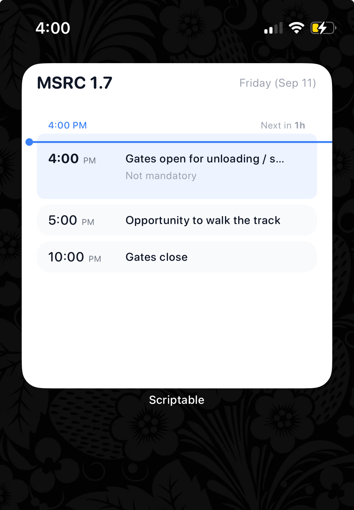

# iPhone Home Screen widget

`hpde-widget.js` is a [Scriptable](https://scriptable.app/) script that puts
today's HPDE schedule on your iPhone Home Screen, so you can check what's
next without opening the app.

**Latest script:** https://raw.githubusercontent.com/inko9nito/hpde/main/scripts/hpde-widget.js
— always points at the current version on `main`, so it's the easiest thing
to share or open straight from an iPhone.

## Install

1. Install [Scriptable](https://apps.apple.com/app/scriptable/id1405459188) on
   your iPhone (free).
2. Open Scriptable → `+` → paste the contents of
   [`hpde-widget.js`](./hpde-widget.js) (or the evergreen link above) →
   title it "HPDE".
3. Long-press the Home Screen → **Add Widget** → **Scriptable** → pick
   **Medium** or **Large** → Add. The same script handles both sizes;
   Large fits ~10 rows around the "now" line, Medium fits ~3.
4. Tap the widget → **Edit Widget** → **Script** = "HPDE".
5. Optional: set **Parameter** to a comma-separated list of run group ids to
   filter session rows — e.g. `orange` or `orange,blue`. Leave blank to show
   everything. The ids are the ones used in the schedule Markdown files (see
   `../src/data/schedules/*.md`).

## Refresh cadence

iOS decides when to actually rebuild widgets. The script asks for a refresh
every **5 minutes** on an event day, and every **1 hour** otherwise. Force a
manual refresh by long-pressing the widget → Edit Widget → toggle a setting.

## Offline

The script caches the last successful manifest in Scriptable's iCloud
documents. If the network is unreachable it renders the cached data and shows
a small "offline" tag in the header.

## What it shows

- Event name + day
- Up to ~5 rows around now: 1 recent past + 4 upcoming
- A blue "now" line with a countdown to the next event (red ≤5 min,
  orange ≤10 min, otherwise gray) — matches the web app's `TimeIndicator`
- Session rows show colored dots for each run group on track, plus "in <color>"
  when there's a classroom group
- Lunch / special rows use bold text; lunch also gets a fork.knife SF Symbol icon

If no event is scheduled for today, the widget renders a small "No event
today." card. (Future work could show a preview of the next upcoming event
in that empty state.)

## Adding a new run-group color

The widget doesn't ship its own color table — it reads colors from
`events.json`, and that file's colors are resolved at build time from the
project's Tailwind palette (see `src/utils/eventsJson.ts` →
`resolveTailwindBgColor`). If you introduce a `bgClass` in a schedule MD file
that Tailwind doesn't recognize, `npm run build` fails loudly and blocks
deploy. So the widget stays in sync with the web app by construction — there
is no separate list to keep updated.
